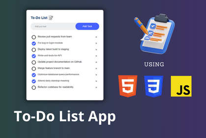

# To-Do List App



## Introduction

Welcome to the To-Do List App project! This application is a simple, yet efficient task manager that allows users to keep track of their tasks. The tasks are stored locally in the browser's local storage, ensuring that your to-do items persist even when the page is reloaded.

## Deployment

You can view the deployed project at: [Deployment Link](https://todo-list-app-project.hafeezbaig.in/)

## Features

- **Add Tasks:** Easily add new tasks to your list.
- **Delete Tasks:** Remove tasks that are no longer needed.
- **Persist Data:** Tasks are stored in the browser's local storage, so they are not lost on page reload.

## Prerequisites

Before you get started, make sure you have a modern web browser that supports local storage.

## Installation

To set up the project on your local machine, follow these steps:

1. **Clone the repository:**

   ```bash
   git clone https://github.com/Hafeezbaig/To-Do-List-App-Project
   cd To-Do-List-App-Project
   ```

2. **Open the project:**

   Open the `index.html` file in your preferred web browser.

## Running the Project

Simply open the `index.html` file in your browser to start using the To-Do List App. There are no dependencies or servers required.

## Usage

1. **Add a Task:** Enter a task in the input field and click the "Add Task" button.
2. **Delete a Task:** Click the "Delete" button next to a task to remove it from the list.
3. **Persisted Data:** Refresh the page and notice that your tasks remain intact.

## Summary

This project demonstrates a basic implementation of a to-do list using HTML, CSS, and JavaScript, with tasks stored in the browser's local storage. It is a great starting point for beginners looking to understand the fundamentals of web development and local storage usage.

Feel free to contribute to the project or use it as a reference for your own development needs. For any issues or suggestions, please open an issue in the [GitHub repository](https://github.com/Hafeezbaig/To-Do-List-App-Project/issues).

## Made By

This project is developed by [Hafeez Baig](https://www.hafeezbaig.in).

## Connect

- [Portfolio](https://www.hafeezbaig.in)
- [Connect](https://connect.hafeezbaig.in)

## Socials

- [GitHub](https://github.com/Hafeezbaig)
- [LinkedIn](https://www.linkedin.com/in/mohammed-abdul-hafeez-baig-52b21b209/)
- [Instagram](https://www.instagram.com/mohammed_hafeez_baig/)

## Feedback or Bugs report

- [Talk](https://talk.hafeezbaig.in)